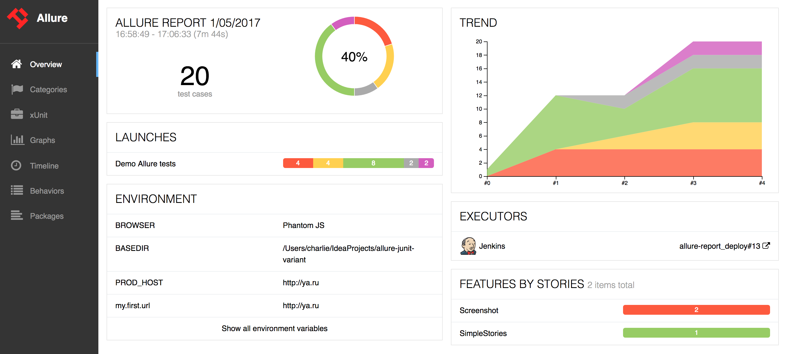

[license]: http://www.apache.org/licenses/LICENSE-2.0 "Apache License 2.0"
[blog]: https://qameta.io/blog
[gitter]: https://gitter.im/allure-framework/allure-core
[gitter-ru]: https://gitter.im/allure-framework/allure-ru
[twitter]: https://twitter.com/QametaSoftware "Qameta Software"
[twitter-team]: https://twitter.com/QametaSoftware/lists/team/members "Team"
[build]: https://ci.qameta.io/job/allure2/job/master "Build"
[build-badge]: https://ci.qameta.io/buildStatus/icon?job=allure2/master
[maven]: https://repo.maven.apache.org/maven2/io/qameta/allure/allure-commandline/ "Maven Central"
[maven-badge]: https://img.shields.io/maven-central/v/io.qameta.allure/allure-commandline.svg?style=flat
[release]: https://github.com/allure-framework/allure2/releases/latest "Latest release"
[release-badge]: https://img.shields.io/github/release/allure-framework/allure2.svg?style=flat
[CONTRIBUTING.md]: .github/CONTRIBUTING.md
[CODE_OF_CONDUCT.md]: CODE_OF_CONDUCT.md
[docs]: https://docs.qameta.io/allure/

# Allure Report [![build-badge][]][build] [![release-badge][]][release] [![maven-badge][]][maven] [](#backers) [](#sponsors)

Allure Framework is a flexible lightweight multi-language test report tool that not only
shows a very concise representation of what have been tested in a neat web report form,
but allows everyone participating in the development process to extract maximum of useful
information from everyday execution of tests.



## Download

You can use one of the following ways to get Allure:

* Grab it from [bintray](https://bintray.com/qameta/maven/allure2) (see Downloads section).
* Using Homebrew:

    ```bash
    $ brew install allure
    ```
* For Windows, Allure is available from the [Scoop](http://scoop.sh/) commandline-installer.
To install Allure, download and install Scoop and then execute in the Powershell:

    ```bash
    scoop install allure
    ```


## Documentation

All the documentation is available [on our site][docs].

## Staying in Touch

Follow [@QametaSoftware][twitter] and its [team members][twitter-team] on Twitter. In-depth articles can
be found at [Qameta Blog][blog]. Also feel free to join our
[Gitter room][gitter] ([ru][gitter-ru]).

## Code of Conduct

Please note that this project is released with a [Contributor Code of Conduct][CODE_OF_CONDUCT.md]. By participating in this project you agree to abide by its terms.

## Gold sponsors

[Become a gold sponsor](https://opencollective.com/allure-report#sponsor) and get your logo on our README on Github with a link to your site.

<a href="https://opencollective.com/allure-report/tiers/gold-sponsors/0/website?requireActive=false" target="_blank"></a>
<a href="https://opencollective.com/allure-report/tiers/gold-sponsors/1/website?requireActive=false" target="_blank"></a>
<a href="https://opencollective.com/allure-report/tiers/gold-sponsors/2/website?requireActive=false" target="_blank"></a>
<a href="https://opencollective.com/allure-report/tiers/gold-sponsors/3/website?requireActive=false" target="_blank"></a>
<a href="https://opencollective.com/allure-report/tiers/gold-sponsors/4/website?requireActive=false" target="_blank"></a>
<a href="https://opencollective.com/allure-report/tiers/gold-sponsors/5/website?requireActive=false" target="_blank"></a>
<a href="https://opencollective.com/allure-report/tiers/gold-sponsors/6/website?requireActive=false" target="_blank"></a>
<a href="https://opencollective.com/allure-report/tiers/gold-sponsors/7/website?requireActive=false" target="_blank"></a>
<a href="https://opencollective.com/allure-report/tiers/gold-sponsors/8/website?requireActive=false" target="_blank"></a>
<a href="https://opencollective.com/allure-report/tiers/gold-sponsors/9/website?requireActive=false" target="_blank"></a>

## Silver sponsors

[Become a silver sponsor](https://opencollective.com/allure-report#sponsor) and get your logo on our README on Github with a link to your site.

<a href="https://opencollective.com/allure-report/tiers/silver-sponsors/0/website?requireActive=false" target="_blank"></a>
<a href="https://opencollective.com/allure-report/tiers/silver-sponsors/1/website?requireActive=false" target="_blank"></a>
<a href="https://opencollective.com/allure-report/tiers/silver-sponsors/2/website?requireActive=false" target="_blank"></a>
<a href="https://opencollective.com/allure-report/tiers/silver-sponsors/3/website?requireActive=false" target="_blank"></a>
<a href="https://opencollective.com/allure-report/tiers/silver-sponsors/4/website?requireActive=false" target="_blank"></a>
<a href="https://opencollective.com/allure-report/tiers/silver-sponsors/5/website?requireActive=false" target="_blank"></a>
<a href="https://opencollective.com/allure-report/tiers/silver-sponsors/6/website?requireActive=false" target="_blank"></a>
<a href="https://opencollective.com/allure-report/tiers/silver-sponsors/7/website?requireActive=false" target="_blank"></a>
<a href="https://opencollective.com/allure-report/tiers/silver-sponsors/8/website?requireActive=false" target="_blank"></a>
<a href="https://opencollective.com/allure-report/tiers/silver-sponsors/9/website?requireActive=false" target="_blank"></a>

## Bronze sponsors

[Become a bronze sponsor](https://opencollective.com/allure-report#sponsor) and get your logo on our README on Github with a link to your site.

<a href="https://opencollective.com/allure-report/tiers/bronze-sponsors/0/website?requireActive=false" target="_blank"></a>
<a href="https://opencollective.com/allure-report/tiers/bronze-sponsors/1/website?requireActive=false" target="_blank"></a>
<a href="https://opencollective.com/allure-report/tiers/bronze-sponsors/2/website?requireActive=false" target="_blank"></a>
<a href="https://opencollective.com/allure-report/tiers/bronze-sponsors/3/website?requireActive=false" target="_blank"></a>
<a href="https://opencollective.com/allure-report/tiers/bronze-sponsors/4/website?requireActive=false" target="_blank"></a>
<a href="https://opencollective.com/allure-report/tiers/bronze-sponsors/5/website?requireActive=false" target="_blank"></a>
<a href="https://opencollective.com/allure-report/tiers/bronze-sponsors/6/website?requireActive=false" target="_blank"></a>
<a href="https://opencollective.com/allure-report/tiers/bronze-sponsors/7/website?requireActive=false" target="_blank"></a>
<a href="https://opencollective.com/allure-report/tiers/bronze-sponsors/8/website?requireActive=false" target="_blank"></a>
<a href="https://opencollective.com/allure-report/tiers/bronze-sponsors/9/website?requireActive=false" target="_blank"></a>

## Backers

Thank you to all our backers! 🙏 [[Become a backer](https://opencollective.com/allure-report#backer)]

<a href="https://opencollective.com/allure-report#backers" target="_blank"></a>

## Contributors

This project exists thanks to all the people who contribute. [[Contribute]](.github/CONTRIBUTING.md).

<a href="graphs/contributors"></a>

## License

The Allure Framework is released under version 2.0 of the [Apache License][license].
