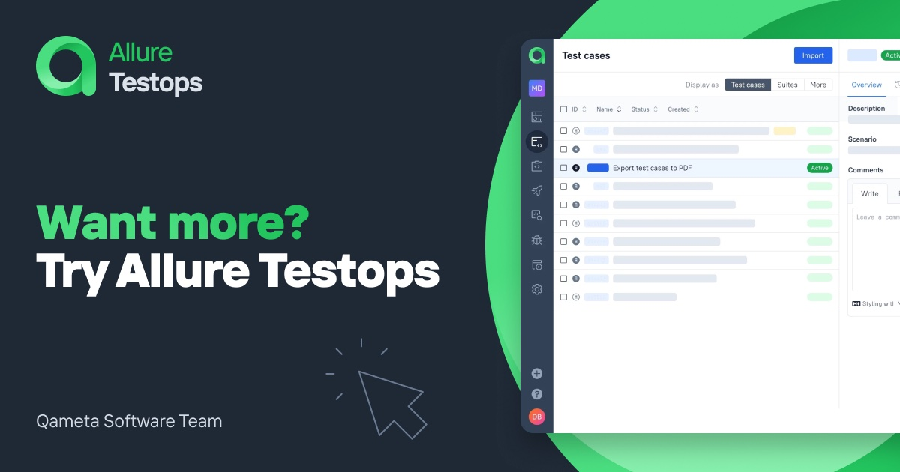

[license]: http://www.apache.org/licenses/LICENSE-2.0 "Apache License 2.0"
[site]: https://qameta.io/?source=Report_GitHub
[blog]: https://qameta.io/blog
[gitter]: https://gitter.im/allure-framework/allure-core
[gitter-ru]: https://gitter.im/allure-framework/allure-ru
[tg-ru]: https://t.me/allure_ru
[twitter]: https://twitter.com/QametaSoftware "Qameta Software"
[twitter-team]: https://twitter.com/QametaSoftware/lists/team/members "Team"
[build]: https://github.com/allure-framework/allure2/actions/workflows/build.yaml
[build-badge]: https://github.com/allure-framework/allure2/actions/workflows/build.yaml/badge.svg
[maven]: https://repo.maven.apache.org/maven2/io/qameta/allure/allure-commandline/ "Maven Central"
[maven-badge]: https://img.shields.io/maven-central/v/io.qameta.allure/allure-commandline.svg?style=flat
[release]: https://github.com/allure-framework/allure2/releases/latest "Latest release"
[release-badge]: https://img.shields.io/github/release/allure-framework/allure2.svg?style=flat
[CONTRIBUTING.md]: .github/CONTRIBUTING.md
[CODE_OF_CONDUCT.md]: CODE_OF_CONDUCT.md
[docs]: https://docs.qameta.io/allure-report/
[discussions]: https://github.com/allure-framework/allure2/discussions

# Allure Report

[![build-badge][]][build] [![release-badge][]][release] [![maven-badge][]][maven] [](#backers) [](#sponsors)

Allure Report is a flexible multi-language test report tool to show you a detailed representation of what has been tested end extract max from the everyday execution of tests. 


Allure Report is capable to build unified reports for dozens of testing tools across eleven programming languages on several CI/CD systems. 
Read more at the [official website](https://qameta.io/allure-report) of the project.


## Download

You can use one of the following ways to get Allure:

* Grab it from [releases](https://github.com/allure-framework/allure2/releases) (see Assets section).
* Using Homebrew:

    ```bash
    $ brew install allure
    ```
* For Windows, Allure is available from the [Scoop](http://scoop.sh/) commandline-installer.
To install Allure, download and install Scoop and then execute in the Powershell:

    ```bash
    scoop install allure
    ```


## Documentation

All the documentation is available [on our website][docs].

## Allure TestOps
    
DevOps-ready Testing Platform built to reduce code time-to-market without quality loss. Level up your product quality control and boost your QA and development team productivity by setting up your TestOps. 
    
Now, Allure TestOps Cloud is generally available to all development teams! Try it on our [website][site].
    
[][site]
    
## Join Allure community

Follow [@QametaSoftware][twitter] and its [team members][twitter-team] on Twitter. In-depth articles can be found at [Qameta Software Blog][blog]. 

There are thousands of Allure users all over the world. Feel free to join [GitHub Discussions][discussions] to ask questions, share ideas, or help others with a piece of advice.

If you are looking for a wholesome company of Allure folks, take a look at [Gitter chat][gitter].
    
## Code of Conduct

Please note that this project is released with a [Contributor Code of Conduct][CODE_OF_CONDUCT.md]. By participating in this project you agree to abide by its terms.

## Contributors

This project exists thanks to all the people who contributed. [[Contribute]](.github/CONTRIBUTING.md).

<a href="https://github.com/allure-framework/allure2/graphs/contributors"></a>

## License

The Allure Framework is released under version 2.0 of the [Apache License][license].
