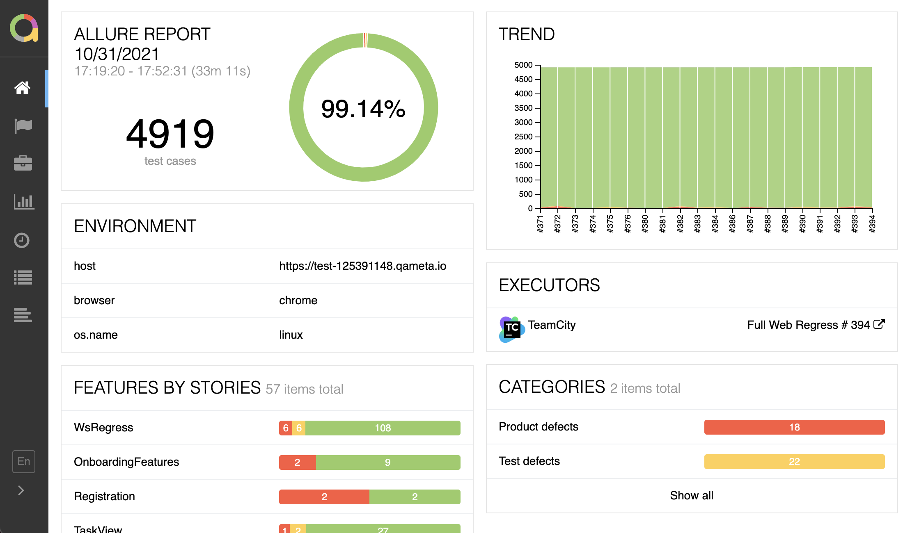

[license]: http://www.apache.org/licenses/LICENSE-2.0 "Apache License 2.0"
[site]: https://qameta.io/?source=Report_GitHub
[blog]: https://qameta.io/blog
[gitter]: https://gitter.im/allure-framework/allure-core
[gitter-ru]: https://gitter.im/allure-framework/allure-ru
[tg-ru]: https://t.me/allure_ru
[twitter]: https://twitter.com/QametaSoftware "Qameta Software"
[twitter-team]: https://twitter.com/QametaSoftware/lists/team/members "Team"
[build]: https://github.com/allure-framework/allure2/actions/workflows/build.yaml
[build-badge]: https://github.com/allure-framework/allure2/actions/workflows/build.yaml/badge.svg
[maven]: https://repo.maven.apache.org/maven2/io/qameta/allure/allure-commandline/ "Maven Central"
[maven-badge]: https://img.shields.io/maven-central/v/io.qameta.allure/allure-commandline.svg?style=flat
[release]: https://github.com/allure-framework/allure2/releases/latest "Latest release"
[release-badge]: https://img.shields.io/github/release/allure-framework/allure2.svg?style=flat
[CONTRIBUTING.md]: .github/CONTRIBUTING.md
[CODE_OF_CONDUCT.md]: CODE_OF_CONDUCT.md
[docs]: https://docs.qameta.io/allure-report/

# Allure Report

[![build-badge][]][build] [![release-badge][]][release] [![maven-badge][]][maven] [](#backers) [](#sponsors)


Allure Framework is a flexible, lightweight multi-language test report tool that not only shows a very concise representation of what has been tested in a neat web report form but allows everyone participating in the development process to extract the maximum of useful information from the everyday execution of tests.



## Download

You can use one of the following ways to get Allure:

* Grab it from [releases](https://github.com/allure-framework/allure2/releases) (see Assets section).
* Using Homebrew:

    ```bash
    $ brew install allure
    ```
* For Windows, Allure is available from the [Scoop](http://scoop.sh/) commandline-installer.
To install Allure, download and install Scoop and then execute in the Powershell:

    ```bash
    scoop install allure
    ```


## Documentation

All the documentation is available [on our website][docs].

## Allure TestOps

DevOps-ready Testing Platform that brings together automated and manual testing.
Level up your product quality control and boost your QA and development team productivity by setting your TestOps. Try it on our [website][site].

[][site]

## Staying in Touch

Follow [@QametaSoftware][twitter] and its [team members][twitter-team] on Twitter. In-depth articles can
be found at [Qameta Blog][blog]. Also feel free to join our GitHub discussions or
[Telegram chat][tg-ru] (ru).

## Code of Conduct

Please note that this project is released with a [Contributor Code of Conduct][CODE_OF_CONDUCT.md]. By participating in this project you agree to abide by its terms.

## Contributors

This project exists thanks to all the people who contribute. [[Contribute]](.github/CONTRIBUTING.md).

<a href="https://github.com/allure-framework/allure2/graphs/contributors"></a>

## License

The Allure Framework is released under version 2.0 of the [Apache License][license].
