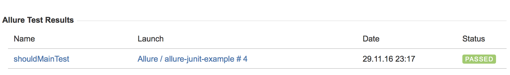
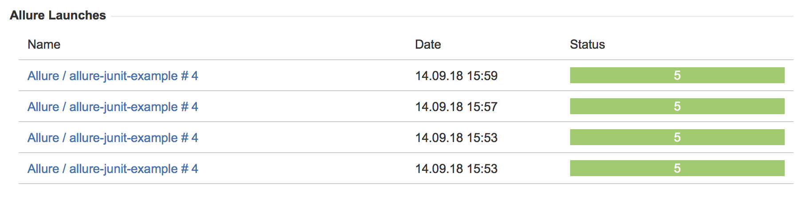

# Allure Jira Plugin

This plugin requires `executor.json` file (which automatically generates by Jenkins, TeamCity, Bamboo) in test result directory.
This file contains information about report location for backlinks from Jira.

This plugin requires 'Allure for Jira' plugin installed in your Jira.
You can find it at [Atlassian Marketplace](https://marketplace.atlassian.com).

## Export TestResult information

How it works:
* add issue link in your test cases (for example in java: `@Issue("ALLURE-1")`)
* enable plugin - add env property `ALLURE_JIRA_ENABLED=true`
* setup Jira env variables:
  * `ALLURE_JIRA_ENDPOINT=https://<jira>/jira/rest/`
  * `ALLURE_JIRA_USERNAME=<username>`
  * `ALLURE_JIRA_PASSWORD=<password>`
* generate report

After that you will see such panel in Jira issue:

## Export Launch information

How it works:
* enable plugin - add env property `ALLURE_JIRA_ENABLED=true`
* set issue for launch export - add env property `ALLURE_JIRA_LAUNCH_ISSUES=ALLURE-2`
* setup Jira env variables:
  * `ALLURE_JIRA_ENDPOINT=https://<jira>/jira/rest/`
  * `ALLURE_JIRA_USERNAME=<username>`
  * `ALLURE_JIRA_PASSWORD=<password>`
* generate report

After that you will see such panel in Jira issue:

