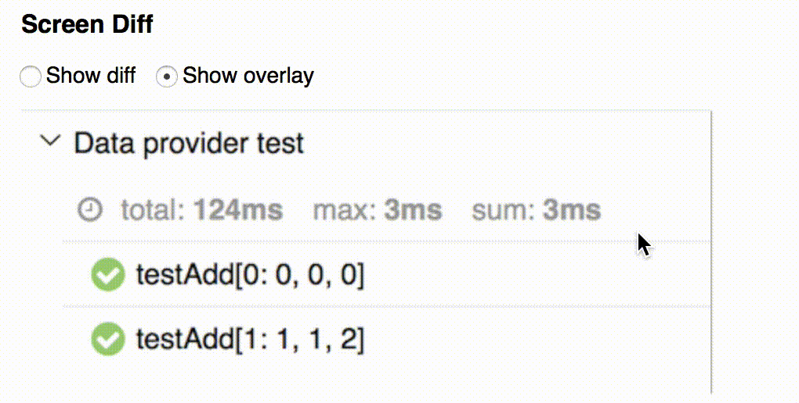

## Allure Screen Diff Plugin

Plugin provides screen diff block

### Configuration

* Add label [key='testType', value='screenshotDiff'] to testcase
* Attach to testcase three screenshots:
  * diff.png
  * actual.png
  * expected.png
* Generate allure report

### Show diff view

### Show overlay view

