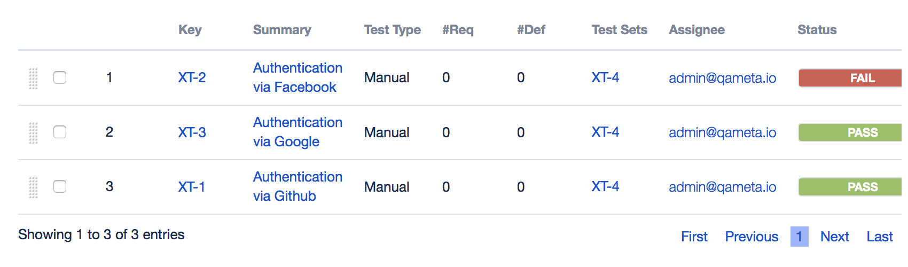

# Allure Xray Plugin

How it works:
* add tms link in your test cases (for example in java: `@TmsLink("XT-1")`)
* setup Jira env variables:
  * `ALLURE_JIRA_ENDPOINT=https://<jira>/jira/rest/`
  * `ALLURE_JIRA_USERNAME=<username>`
  * `ALLURE_JIRA_PASSWORD=<password>`
* enable plugin - add env property `ALLURE_XRAY_ENABLED=true`
* provide execution issue keys - add env property `ALLURE_XRAY_EXECUTION_ISSUES=XT-6`
* generate report

After that allure update testruns statuses from report:

